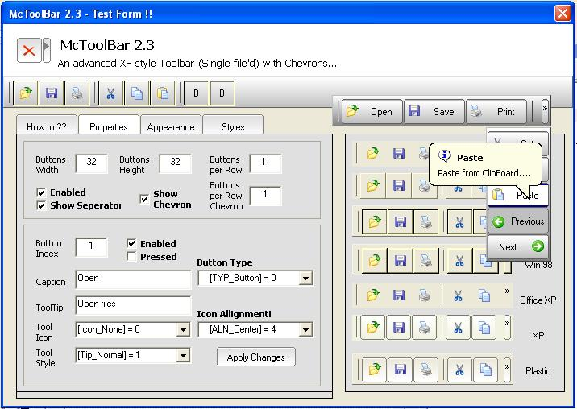

## McToolBar 2\.3 \- \[Advanced multi\-style toolbar with Chevrons\]

### Description

Hi guys, The new version of McToolBar-2.3 is released now and it claims itself as the most advanced toolbar writen in VB. It could solve the very big task 'Chevrons' (see Screenshot) and have multi-style appearance. All the drawing routines are completly re-writen and it works very sooth. The features includes... single file'd, ownerdraw with, multi-styles(Flat,Soft,Solid,Win98,WinXP,Plastic and full range of colour options), HoverEffect, Custom ToolTips with balloon style and icons, Unicode support, fully customizable Gradient effects, Tiled background and many more... It is stylish, customizable and easy to use. "The control does not use any property pages for item manipulation! All the opeartions can be done

directly from the vb's property window". Thanks for all who helped me in the previous release

with there comments and feedbacks. Lets try the new one and make this control more perfect!!! Jim Jose
 
### More Info
 

             |
---                |---
**Submitted On**   |2006-01-12 04:10:32
**By**             |[JJJJJJJJ](https://github.com/Planet-Source-Code/PSCIndex/blob/master/ByAuthor/jjjjjjjj.md)
**Level**          |Intermediate
**User Rating**    |4.9 (246 globes from 50 users)
**Compatibility**  |VB 6\.0
**Category**       |[Custom Controls/ Forms/  Menus](https://github.com/Planet-Source-Code/PSCIndex/blob/master/ByCategory/custom-controls-forms-menus__1-4.md)
**World**          |[Visual Basic](https://github.com/Planet-Source-Code/PSCIndex/blob/master/ByWorld/visual-basic.md)
**Archive File**   |[McToolBar\_1964541122006\.zip](https://github.com/Planet-Source-Code/jjjjjjjj-mctoolbar-2-3-advanced-multi-style-toolbar-with-chevrons__1-64008/archive/master.zip)

